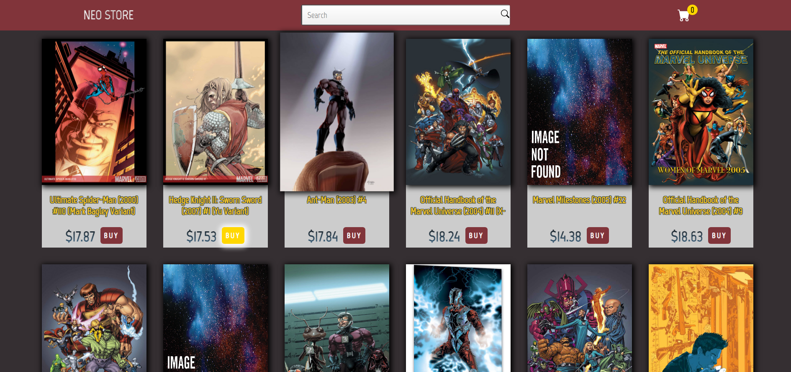
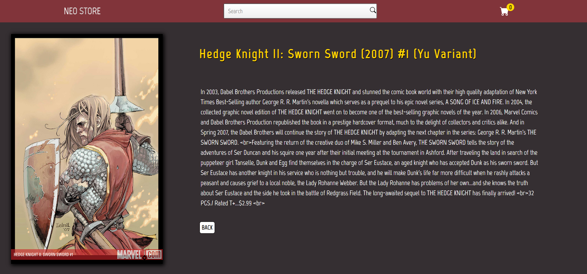
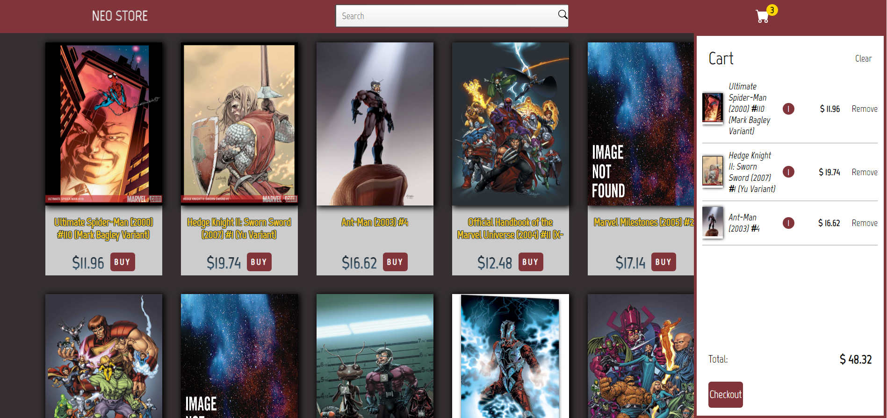
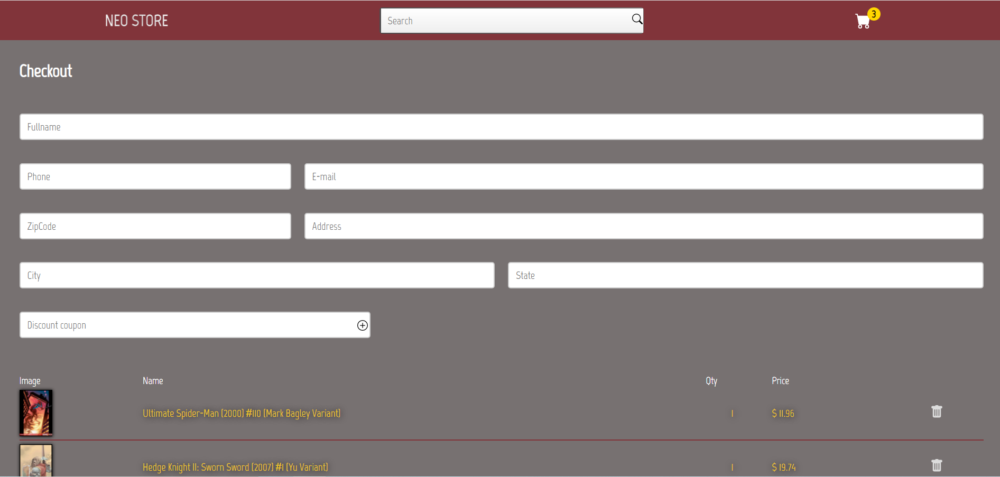

## Teste para vaga de Frontend JR NeoApp

<p>Objetivo do teste é desenvolver uma loja de quadrinhos que consulta a API da Marvel que contem vários itens como personagens, quadrinhos, etc...</p>
<p>Como alguns itens não vinham com preço foi gerado um preço aleatório para cara quadrinho e adicionado uma condição para se fosse um quadrinho raro</p>

##

- ```yarn install``` - para baixar as dependências;
- ```yarn start``` - para <strong>executar</strong> a aplicação;
- ```yarn test``` - para testar usando <strong>Cypress</strong>;
##

<strong>Abaixo segue alguns prints da aplicação e os desafios propostos.</strong>

 - [x] Utilização de ReactJs ou NextJs
 - [x] Estilização feita com Styled Components
 - [x] Realizar teste E2E com Cypress nos fluxos que achar necessário
 - [x] Que a UI seja autoral do participante, esteticamente bonita e simples de usar
 - [x] Layout responsivo / mobile first
 - [x] Ver o website rodando em algum host estático (Heroku, Netlify, Vercel, Github
 
 ##
 
 - [ ] Utilização de Redux Toolkit para gerenciamento de estado global
 - [x] HTML escrito de maneira semântica
 - [x] Animações em CSS ou com alguma biblioteca externa (Cuidado com a performance do seu website😄)
 - [ ] Utilização de Docker na conteinerização da aplicação
 ##
 ## Essencial no teste:
 
 - [x] Uma listagem paginada das histórias em quadrinhos (HQ's);
 - [x] Uma página de visualização individual da HQ;
 - [x] E o carrinho;
## Opcionais:
 - [x] Na listagem de HQ's, 10% dos quadrinhos mostrados devem ser marcados
como raros aleatoriamente ao carregar;
 - [x] O carrinho deve apresentar a possibilidade de inserir um cupom de desconto
com validação mock, sem API;
 - [x] Por fim, existiriam dois tipos de cupons: os cupons comuns e os raros. Que
seriam aplicados somente para HQ's respectivamente comuns e raras.
## Cupons para serem aplicados:
 
 - <strong>```NEOMARVELGOLD1```</strong> - para um quadrinho raro;
 - <strong>```PROMONEOMARVEL```</strong> - para quadrinho comum

## 
<p align="center">
  
  
  
  
</p>

##

<footer>Desenvolvido com :heart: por Jocsã :wave:</footer>